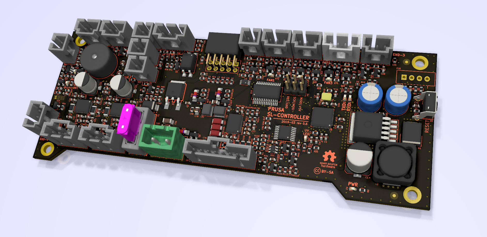

# PRUSA SL controller board

KiCad PCB layout

* [Interactive bom](http://htmlpreview.github.io/?https://github.com/prusa3d/SL-CONTROLLER-PCB/blob/master/rev.06c/ibom.html)
* [STEP 3D model](rev.06c/SL-controller-06c.step)
